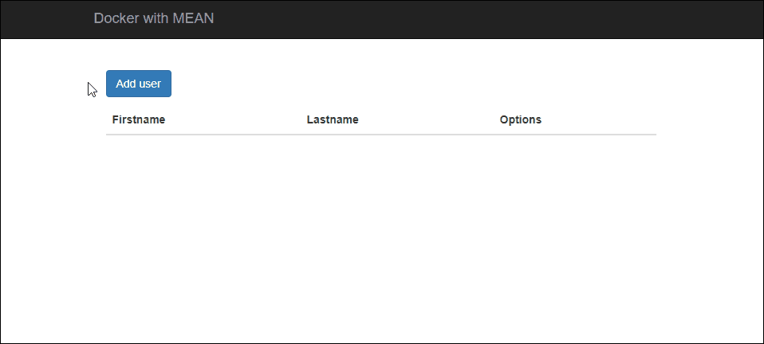

# docker-mean

[![License][license-badge]][license-url]

> A playground for Docker with MEAN stack.



# Development

* Cloning the repo

```bash
$ git clone https://github.com/robertoachar/docker-mean.git
```

* Installing dependencies

```bash
$ npm install
```

# Docker

* Build image

```bash
$ docker-compose build
```

* Start containers

```bash
$ docker-compose up
```

* Stop containers

```bash
$ docker-compose down
```

# Author

[Roberto Achar](https://twitter.com/robertoachar)

# License

[MIT](https://github.com/robertoachar/docker-mean/blob/master/LICENSE)

[license-badge]: https://img.shields.io/github/license/robertoachar/docker-mean.svg
[license-url]: https://opensource.org/licenses/MIT
